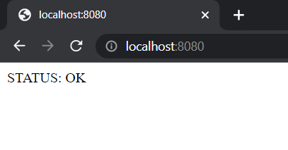
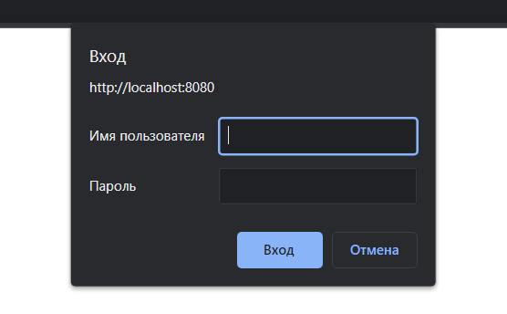
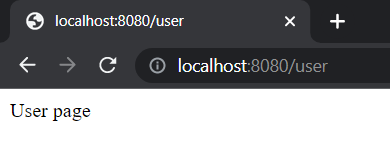
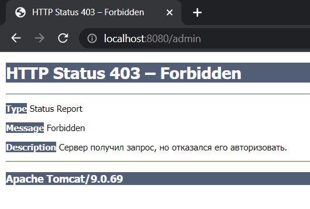
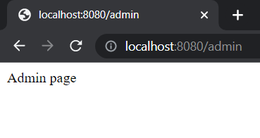

# Caruction
<h2>A simple car auction app</h2>

<h3>test credentials</h3>

login: user  
password: 1234

login: admin  
password: 1234

Healthcheck endpoint of the application: 

Authorisation form: 

If authorised user role - "user", only user page may be accessible, admin page will have status 403 FORBIDDEN: 

But if user role - "admin", he has access to all pages (/user, /admin)

